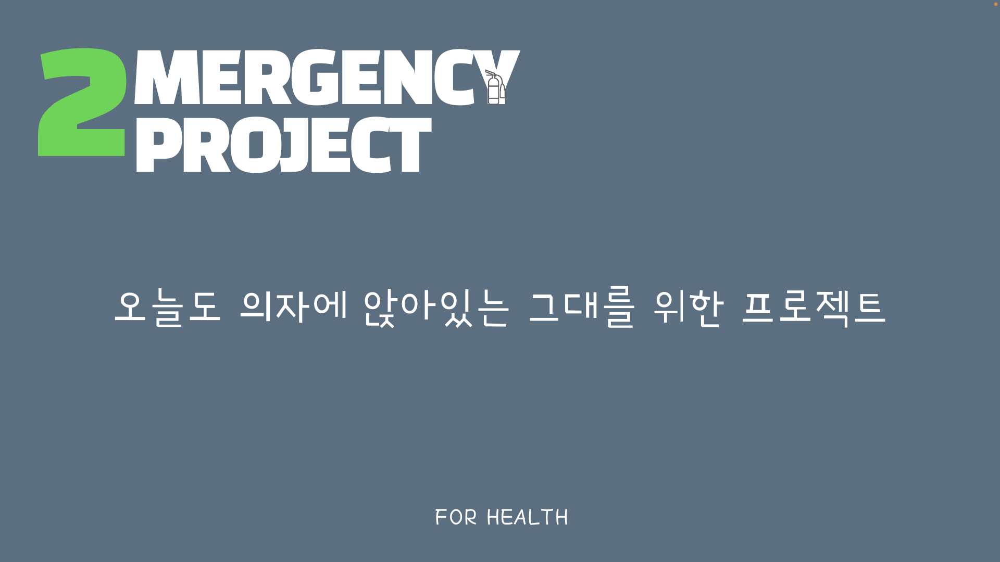
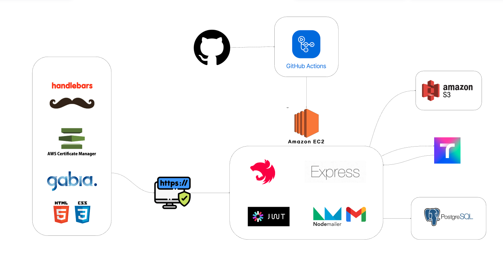

# 오늘도 의자에 앉아있는 그대를 위한 🏃‍♂️🏃‍♀️ 2MERGENCY PROJECT 🔥

   

## 프로젝트 소개
커뮤니티를 이용하여 산책과 러닝, 등산을 서로 독려하며 즐겁고 건강한 생활을 할 수 있도록 돕는 목표를 가지고 이 프로젝트를 진행하였습니다.

 

[ 🔥&nbsp;&nbsp;노션 ](https://www.notion.so/teamsparta/2mergency-b98d6285b838434e8382265364e0e9ec?pvs=4 "2MERGENCY PROJECT")

[ 🔥&nbsp;&nbsp;ERD ](https://drawsql.app/teams/heh-2/diagrams/youngjun "2MERGENCY PROJECT")

[ 🔥&nbsp;&nbsp;API 명세서 ](https://www.notion.so/teamsparta/55442151682547d98b339a163311924d?v=15763b8a654b4e19b4182769035d0e75&pvs=4 "2MERGENCY PROJECT")

[ 🔥&nbsp;&nbsp;Wireframe/ 플로우 차트 ](https://miro.com/app/board/uXjVKbS5It8=/ "2MERGENCY PROJECT")

 

# 🗓 개발 기간

> __전체 개발 기간__ :  2024.03.26 ~ 2024.05.01
> 
> 🔧 &nbsp; 중간 발표 : 2024.04.16
> 
> 🔧 &nbsp; 최종 발표 : 2024.05.02

+ 기획, ERD, Wireframe, 플로우 차트 작성 : __03.26 ~ 03.30__

+ 기능 구현 :  __03.30 ~ 04.29__

+ 프론트 연결 작업 : __04.22 ~ 04.29__

+ 최종 점검 : __04.29 ~ 05.01__
  
 
 

# 🌐 개발 환경

   

 

# 🔩 기술 스택

 

 

 

 

 

# 📌 역할

> 이승도 
+ Hbs(Handlebars), 
+ Geolocation api, 
+ Records crud, 
+ Groups crud, 
+ AJAX, 
+ Nodemailer, 
+ Swagger

 

# 🖋 프로젝트 기능 설명
+ Groups : 모두가 볼 수 있는 커뮤니티 기능

+ Records : 운동 시작 시간, 운동 종료 시간, 총 걸은 거리수, 시작 지점 좌표, 중지 지점 좌표등을
            기록할 수 있는 커뮤니티

+ Hbs(Handlebars) : 백엔드에서 전달된 데이터를 기반으로 프론트엔드의 HTML을 연동하여 동적인 웹 페이지를 생성하는데에 사용

+ Geolocation Api : 운동 경로 안내, 랜덤 경로 안내, 건물 이름 검색 등이 가능하고 운동 경로 추적 실행과 경로 추적 해제가 가능

+ AJAX : Geolocation Api에서의 경로 추적 해제 버튼 동작 시, Records 테이블에 데이터를 전송시켜주는 방식

